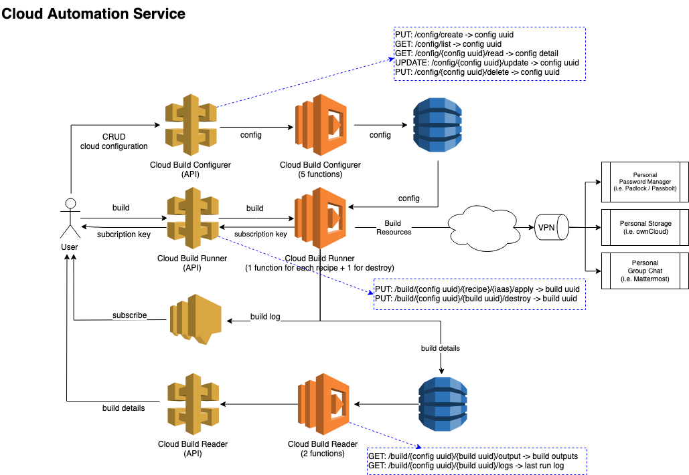
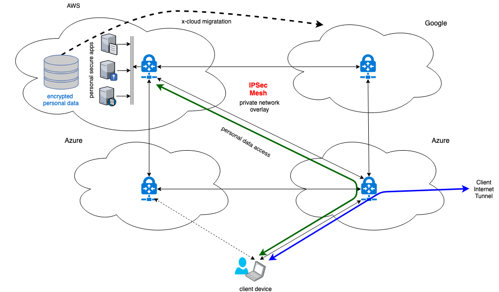
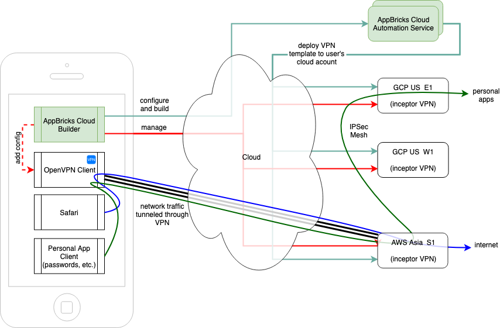
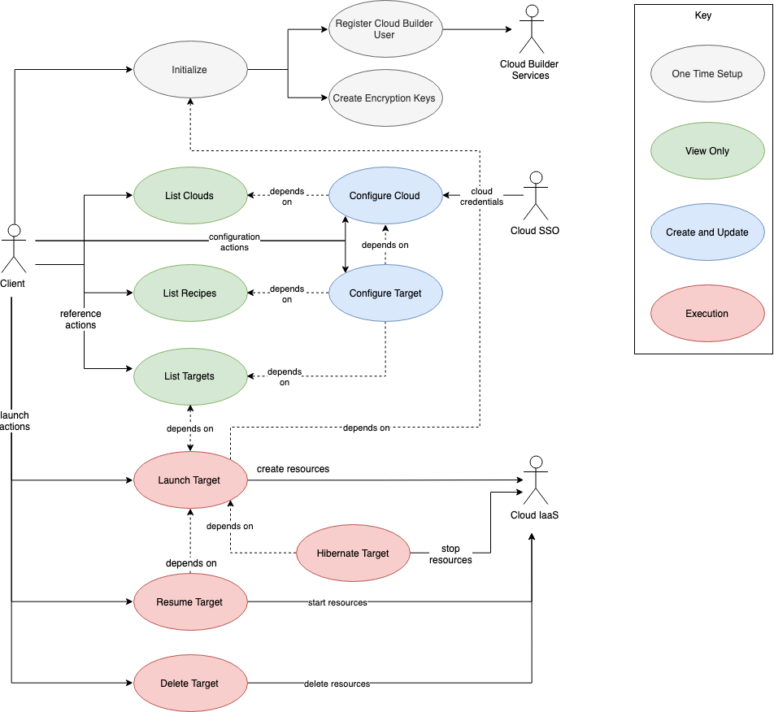

# Cloud Automation Service

## Overview

The automation service can be implemented either as a collection of AWS lambda functions behind an AWS API gateway invoked via a thin client application or executed locally via a thick client application such as a CLI. The underlying automation framework is based on the [Terraform](https://terraform.io) automation engine.

The high-level architecture for a thin client that uses the automation services in the cloud is given in the diagram below.

For example the Cloud Builder mobile client invoke these cloud functions as it cannot execute Terraform locally. These functions and associated recipes can be used to build a secured network mesh across multiple clouds. This sandboxed cloud network can then be used to host personal resources as well encrypted data, as shown below. Additional functions will provide the ability to migrate resources and encrypted data across clouds and optimize costs based on recommendations delivered via the client.

This mesh will also provide egress to the internet via a VPN tunnel, and access to all personal resources will traverse the VPN nodes and then the IPSec network mesh providing a secure dark net for hosting personal services.

## Use Cases

### Client Launcher

The launcher use cases describe all client actions around launching cloud builder recipes using a cloud builder client application.

